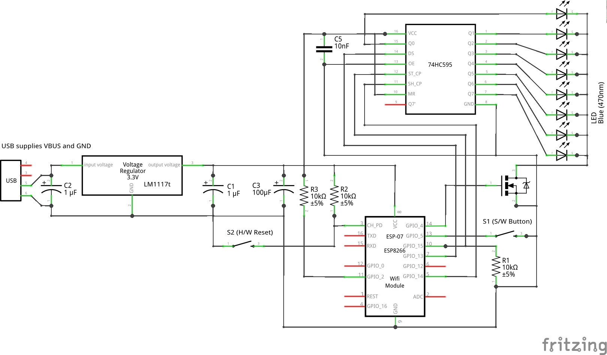

# PureGym activity tracker

Project that uses an ESP12-F connected to shift registers via SPI to
display number of active people in members gym. Contains support for:

* Starting in hotspot mode if can not connect to wifi to accept configuration.
* HTTP server configuration portal (supports `GET`). I.e. for PureGym member name/pin that are stored in flash.
* Basic LED controller that displays 8 LEDs at a given brightness that can either flash, pulse, left/right shift.
* LED brightness can be controlled using pin interrupts on GPIO5 (in the schematic below this is connected to a momentary button switch).
* HTTP client (supports `GET`, `POST`, `Transfer-Encoding: Chunked`, partial cookie jar).

## Schematic

The circuit schematic is shown below:

Consider the following:

* No connections for programming the module are shown, these can be found in the esptool's github readme. The above schematic is compatible with using DTS/RTS to make flashing easier.
* The `1uF` capacitors on the input/output of the voltage regulator are chosen for the `LM1117t`. Amend as required for chosen voltage source.
