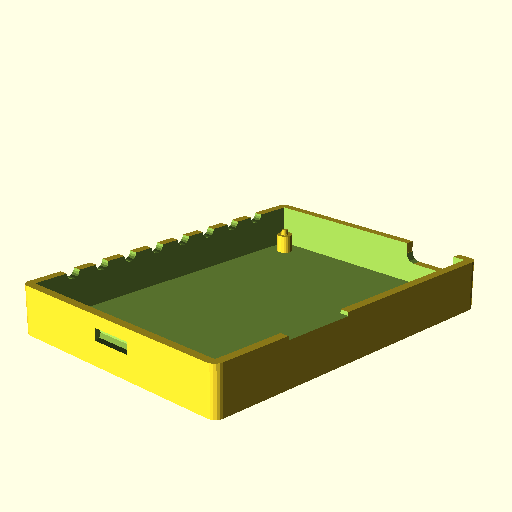

# PureGym activity tracker

Complete project that uses an ESP12-F connected to shift register via
SPI to display number of active people in members gym. Includes
software, circuit diagrams and 3D printer models for the
casing. Moreover, has the following features:

* Starts in hotspot mode (i.e. creates its own WiFi network) if unable
  to connect to pre-configured WiFi. This allows it to accept WiFi
  configuration over a temporary hotspot.

* HTTP server configuration portal (supports `GET`). E.g. for setting
  the WiFI credentials or PureGym member name/pin that are stored
  in flash.

* Implements `uConfig` protocol for configuration. This includes
  device discovery (via UDP broadcast), use of the HTTP server to
  accept configuration requests and update broadcasts. This allows for
  the device to be configured by a general uConfig application. See
  [here](https://github.com/kazkansouh/uConfig) for more information
  about uConfig.

* LED controller that displays 8 LEDs at a given brightness that can
  either flash, pulse, left/right rotate. Currently these modes are
  used to communicate the boot-up status and any errors.

* LED brightness can be controlled using pin interrupts on GPIO5 (in
  the schematic below this is connected to a momentary button switch).

  * It is possible to issue commands via `uConfig` to control
    brightness.

* HTTP client (supports `HTTPS`, `GET`, `POST`, `Transfer-Encoding:
  Chunked`, partial cookie jar).

  * The cookie jar is a sub-minimal implementation that only records
    the cookie name and value to be re-issued on the next
    request. That is, it ignores the domain, expiry, order and other
    attributes.

  * Caution, the `HTTPS` does not validate the certificate.

## Schematic

The circuit schematic is shown below:

Consider the following:

* No connections for programming the module are shown, these can be
  found in the esptool's github readme. The above schematic is
  compatible with using DTS/RTS to make flashing easier.

* The `1uF` capacitors on the input/output of the voltage regulator
  are chosen for the `LM1117t`. Amend as required for chosen voltage
  source.

## 3D Models

The case is printed in two parts, top and bottom. These directly clip
together around a 50mm*70mm perfboard. The cutouts around the side are
for the USB, LEDs and ESP-F antenna. The OpenSCAD models can be found
in the `models` directory.

Unfortunately, as there is no PCB design, these models will probably
need to be tweaked for each build.

### Top

### Bottom

