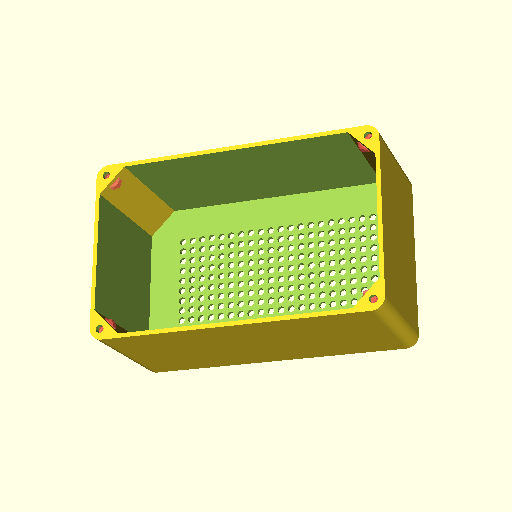
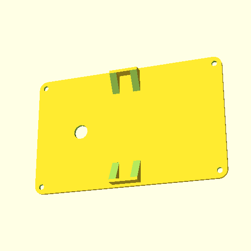

# Web Portal for Clock

This project was developed for an ESP12-F module. It implements:

* WiFi network management, if can not connect to base station will start its own access point to accept WiFi configuration over mini HTTP server.
* Uses HTTP to make a mini site that can be used to issue commands to an Arduino module over UART (flashed with complementary software located: [Time Print](../timeprint/)).
* Arduino module is connected to a LED matrix and is responsible for displaying a clock (i.e. a counter of the form `XX:YY` where `YY` is limited to 59) on the LED matrix. It works independently of this Portal. However, this Portal is used to issue commands such as `Set Time` or `Set Speed` to the Arduino module.
* The `Set Time` command first acquires (via SNTP) the current time, and then sends it to the Arduino module.
* The Arduino module also emits the current state of the LED matrix over UART, which this Portal reads and makes available over HTTP (via JSON) to the web browser so the mini site can view which LEDs are on/off.

Note: *The state of this project is very much a work in progress.*

## 3D Models for LED matrix

The following are renders of the housing of the LED matrix. It consists of two parts, case and lid.

### Case (10*20 LED matrix)

### Lid/Back of case

The lid can be attached to the back with M3 bolts (the red portions of the case are cutouts that will fit an M3 nut). The hole in the middle of the lid is for cable access.

